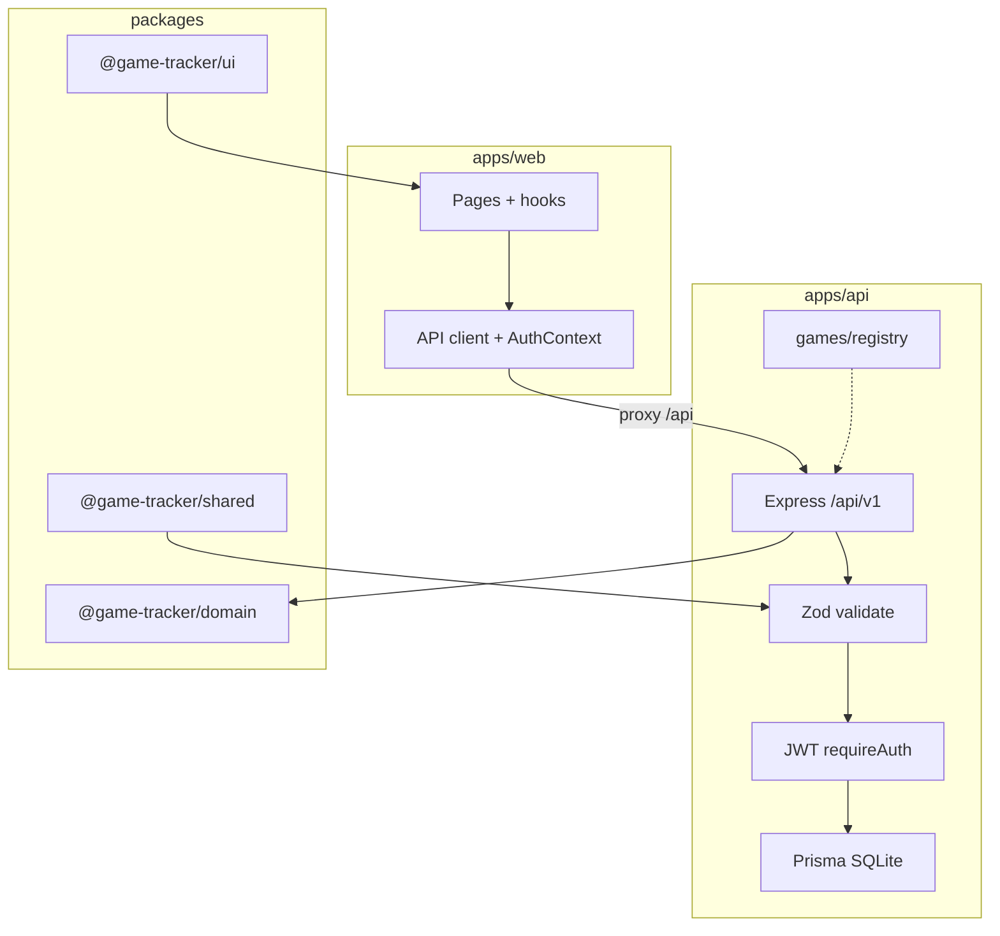

# Game Tracker — Phase 2 Plan

> **Supersedes nothing:** The original TDD MVP plan (`tdd_game_tracker_f16dde5e.plan.md`) stays as the historical record of v1. Use this file for ongoing work.

## 1) MVP status (completed)

| Area | Status | Key paths |
|------|--------|-----------|
| Monorepo | Done | `package.json`, `apps/*`, `packages/*` |
| Shared contracts (Zod v4) | Done | `packages/shared` → `@game-tracker/shared` |
| Domain stats | Done | `packages/domain` → `@game-tracker/domain` |
| UI library | Done | `packages/ui` → `@game-tracker/ui` |
| Prisma + seed | Done | `apps/api/prisma/` |
| JWT auth + CRUD | Done | `apps/api/src/presentation/routes/` |
| Web (dark UI) | Done | `apps/web/src/` |
| Tests | Done | API Jest, package Vitest, Playwright `apps/web/e2e/` |
| Remote | Done | `https://github.com/WyattWagner/gameTracker` |

**Critical fix applied:** Workspace packages use scoped names (`@game-tracker/domain`, etc.) to avoid Node’s built-in `domain` module collision.

---

## 2) Local development runbook

### URLs and ports

| What | URL | Notes |
|------|-----|--------|
| **Web UI** | http://localhost:5173/ | Run `npm run dev:web` |
| **API health** | http://localhost:3001/health | `{"ok":true}` |
| **API base** | http://localhost:3001/api/v1 | JWT on protected routes |
| **API root** | http://localhost:3001/ | `Cannot GET /` today (expected) |

Browser error **-102** = connection refused → the dev server for that port is not running (often web on 5173, not API on 3001).

### Two terminals (from repo root)

```powershell
# Terminal 1 — API
npm.cmd run dev:api

# Terminal 2 — Web
npm.cmd run dev:web
```

Use `npm.cmd` on Windows if PowerShell blocks `npm.ps1`. Optional one-time fix:

```powershell
Set-ExecutionPolicy -Scope CurrentUser RemoteSigned
```

### First-time / after clone

```powershell
npm install
npm run db:migrate
npm run db:seed
npm run build:packages
```

### Backup push

```powershell
.\git-all-push.cmd "your commit message"
```

---

## 3) Architecture (current)



- **Contracts:** All request/response shapes in `@game-tracker/shared`
- **Pure stats:** `computeDashboardStats`, `computeDropAggregation` in `@game-tracker/domain`
- **Game module:** Monster Hunter in API registry + `MonsterStatsPanel` in `@game-tracker/ui`

---

## 4) Gaps vs original E2E vision

| Step | API | Web UI | E2E |
|------|-----|--------|-----|
| Register/login | Yes | Yes | Yes |
| Add monster | Yes | Yes | Yes |
| Create quest | Yes | No | No |
| Log WIN encounter | Yes | No | No |
| Add drop | Yes | Partial | No |
| Dashboard reflects hunt/drop | Yes | Partial | Partial |

Phase 2 should close the UI + E2E gaps before adding new games.

---

## 5) Phase 2 priorities (recommended order)

### 5.1 Developer experience (quick wins)

- Document Windows/`npm.cmd` and port table in `readme.md` or new `SETUP.md`
- Run `npm run build:packages` before first API dev if domain import errors appear
- Optional: fix Vite CJS warning (`type: module` or CJS postcss config)

### 5.2 UI feature parity (TDD per feature)

1. **Log encounter** — form + hook → `POST /api/v1/quests/encounters`; refresh monster + dashboard
2. **Log drop** — form on monster detail → drops CRUD; refresh history
3. **Quest CRUD** — list/create quests linked to monsters

For each: failing hook/component test → implement → extend E2E.

### 5.3 Full E2E hunt flow

Extend `apps/web/e2e/game-tracker.spec.ts`:

1. Login
2. Create monster
3. Create quest with monster
4. Record encounter `WIN`
5. Add drop
6. Assert dashboard counts / recent activity / rarest drop

### 5.4 Dashboard charts

- Add simple bar or pie chart (Recharts or Chart.js) in `packages/ui` or dashboard page
- Feed from existing `GET /stats/dashboard` and `GET /drops/aggregation`

### 5.5 API polish

- Friendly `GET /` JSON with links to `/health` and `/api/v1`
- Optional pagination on list endpoints

### 5.6 CI

- GitHub Actions: `npm install`, `db:migrate`, `build:packages`, `npm test`, `npm run test:e2e`

---

## 6) Monster Hunter expansion (detailed blueprint)

Full spec: **[monster_hunter_feature_expansion.plan.md](./monster_hunter_feature_expansion.plan.md)**

Covers hunt counter controls, images, weakness matrix, ailment stars, LR/HR/MR material tables, and tabbed monster UI. Build order: stats → images → weaknesses → ailments → materials → tests.

---

## 7) Future (post–Phase 2)

- Extract `packages/games/monster-hunter` shared by API + UI
- Second game stub to validate plug-in model
- MSW for richer frontend tests
- Postgres / cloud sync
- Achievements, gear/loadout modules

---

## 8) Testing commands

| Layer | Command |
|-------|---------|
| All workspaces | `npm test` |
| API only | `npm test --workspace api` |
| E2E | `npm run test:e2e` |

**TDD rule:** Red test → minimal implementation → refactor; extend E2E only after API + UI path exists.

---

## 9) Constraints (do not regress)

- Keep scoped package names (`@game-tracker/*`); never rename back to `domain`
- Keep Prisma `metadata` JSON for game-specific fields
- Keep JWT on mutating/list routes except register/login/health
- Do not edit `tdd_game_tracker_f16dde5e.plan.md` (historical v1 plan)
