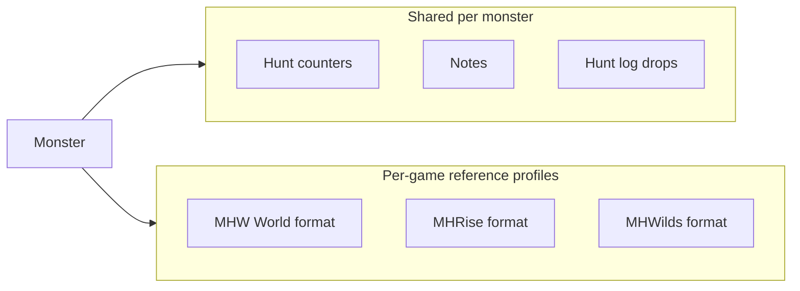

# Monster Hunter — Multi-Game Catalog Plan

> **Parent plans:** [monster_hunter_feature_expansion.plan.md](./monster_hunter_feature_expansion.plan.md) · [game_tracker_phase2.plan.md](./game_tracker_phase2.plan.md)  
> **Source notes:** `.cursor/commands/Add a way of Increasing Each of the coun.ml`

## Objective

Add reference databases for **Monster Hunter Rise (+ Sunbreak)** and **Monster Hunter Wilds**, alongside the existing **MHW World (+ Iceborne)** catalog. Each game uses its own weakness/material presentation. On the monster detail page, users switch between **three game tabs** (World / Rise / Wilds) to view reference data in the format that matches that title.

Personal hunt tracking (counters, hunt log, notes) stays **shared** across tabs. Reference data (weaknesses, ailments, materials, images) is **per game profile**.

---

## Current baseline

| Area | Today | Location |
|------|-------|----------|
| MHW World catalog | 58 monsters, MHW-DB API | `packages/shared/src/data/mhw-monster-catalog.json` |
| Catalog generator | `npm run catalog:generate` | `scripts/generate-mhw-catalog.mjs` |
| Catalog API | `GET /catalog/monsters`, `POST /monsters/from-catalog` | `catalogRouter.ts`, `monstersRouter.ts` |
| Import behavior | Body parts, ailments, elemental matrix from catalog | `applyCatalogMonster.ts` |
| Monster detail tabs | Overview, Weaknesses, Ailments, Materials, Settings, Hunt log | `MonsterDetailPage.tsx` |
| Image | User upload + placeholder | `imageUrl` on `Monster` |

**Gap:** Only one game catalog (`monster-hunter` = World). No Rise/Sunbreak or Wilds data. No per-game reference tabs. Materials not imported from catalog. Catalog images not shown on detail page.

---

## Game-specific display profiles



| Profile | Weakness UI | Body parts | Materials | Notes |
|---------|-------------|------------|-----------|-------|
| **World** | Current matrix (slash/blunt/pierce + 5 elements, 0–99) | Head, Neck, Body, Wing, … | LR / HR / MR drop matrix | Existing implementation |
| **Rise** | Same matrix as World (stars → cells) | Rise-specific part names where different | Rise rank materials from DB | Reuse World components where possible |
| **Wilds** | **Separate tab layout** — elemental weaknesses per body part in Wilds style | Wilds part list | Wilds material sources | New UI component in `@game-tracker/ui` |

---

## Data model (recommended)

### Option A — JSON catalogs in `@game-tracker/shared` (match MHW today)

- `mhw-monster-catalog.json` (exists)
- `mhr-monster-catalog.json` (new)
- `mhwilds-monster-catalog.json` (new)
- `getMonsterCatalog(gameId)` returns the right array

### Option B — Prisma `CatalogMonster` table (future)

Only if catalogs grow too large for git or need admin edits. **Defer** until JSON approach is painful.

### Extended `MonsterCatalogEntry` fields

| Field | Purpose |
|-------|---------|
| `gameId` | `monster-hunter` \| `monster-hunter-rise` \| `monster-hunter-wilds` |
| `imageUrl` | Reference image from database |
| `displayProfile` | `world` \| `rise` \| `wilds` — drives UI component |
| `materials` | `{ rank, name, targetReward?, captureReward?, … }[]` |
| `bodyParts` | Optional override of default part list |
| `elementalWeaknesses` | Existing; Wilds may add per-part entries |

### User monster storage

Store imported per-game reference on `Monster.metadata` or new JSON column:

```json
{
  "catalogProfiles": {
    "monster-hunter": { "catalogId": "rathalos", "importedAt": "…" },
    "monster-hunter-rise": { "catalogId": "magnamalo", "importedAt": "…" }
  }
}
```

Weakness/ailment/material rows can remain in existing Prisma tables keyed by `monsterId`, with optional `gameProfile` column if we need multiple matrices per monster.

---

## UI — Monster detail page

### New top-level structure

```
[Overview] [World] [Rise] [Wilds] [Settings] [Hunt log]
     ↑         ↑      ↑       ↑
  shared    reference tabs (game-specific layouts)
```

- **Overview** — hunt stats, notes, catalog image (if any), quick actions (unchanged).
- **World / Rise / Wilds** — only enabled if that profile has been imported or user adds manually.
  - Weaknesses sub-section (game layout)
  - Ailments sub-section
  - Materials list from catalog + editable matrix
- **Settings** — capture toggle, delete monster (unchanged).
- **Hunt log** — logged drops (unchanged).

### Monsters page — Add from database

1. Choose **game** (World / Rise / Wilds)
2. Search + scroll catalog with **thumbnail**
3. **Add from catalog** → creates tracker entry + seeds that game's reference data

---

## API changes

| Endpoint | Change |
|----------|--------|
| `GET /catalog/monsters` | Required `gameId` query (default `monster-hunter`) |
| `POST /monsters/from-catalog` | Body includes `gameId` + `catalogId`; applies game-specific import |
| `GET /monsters/:id/mh-detail` | Optional `?gameProfile=` or return all profiles |

Import pipeline (`applyCatalogMonster.ts`):

1. Map catalog ailments → resistance bars (missing → `ZERO_AILMENT_BARS`)
2. Map elemental stars → weakness cells (missing element → 0)
3. **New:** create `Material` rows from catalog `materials[]`
4. **New:** set `imageUrl` from catalog if user has no custom upload

---

## Data sourcing (research tasks)

| Game | Candidate sources | Status |
|------|-------------------|--------|
| MHW World | [mhw-db.com](https://mhw-db.com/monsters) | **Done** — 58 entries |
| MHRise + Sunbreak | mhrise-db, kiranico, fan wikis, Fextralife | **TBD** — pick one API or build scraper |
| MHWilds | kiranico, game8, official/community DBs post-launch | **TBD** — confirm stable API |

Document attribution in `MONSTER_CATALOG.md` per game.

---

## Implementation phases

### Phase 1 — Schema + Rise catalog (MVP)

1. Extend shared Zod types + `gameId` on catalog entries
2. Generate Rise catalog (large monsters first)
3. API filter by `gameId`
4. Monsters page game selector
5. Import materials + image on `from-catalog`

### Phase 2 — Wilds catalog + UI

1. Wilds catalog generator
2. `WildsWeaknessPanel` component (separate from World matrix)
3. Third tab on monster detail

### Phase 3 — Multi-profile on one monster

1. Allow same tracker monster to attach Rise **and** Wilds reference tabs
2. `metadata.catalogProfiles` + optional `gameProfile` on MH sub-resources
3. Tab visibility based on which profiles exist

---

## Testing

- Unit: catalog list filter, material import mapping, image URL precedence (user upload > catalog)
- API: `from-catalog` for each `gameId`; Rise monster with missing ailment → zero bars
- Web: game picker renders three groups; detail tab shows correct layout component

---

## Open questions

1. **One monster row vs three** — Should "Rathalos" be one tracker entry with three game tabs, or separate monsters per game? **Recommend:** one entry, multiple reference profiles.
2. **Sunbreak** — Separate `gameId` or tag on Rise entries (`expansion: sunbreak`)?
3. **Image hosting** — Hotlink catalog CDN URLs vs download into `UPLOAD_DIR` on import?

---

## Success criteria

- User can browse and import monsters from **World, Rise, and Wilds** catalogs
- Monster detail shows **game-specific** weakness/material layouts in dedicated tabs
- Catalog **images** and **materials** appear after import
- Existing hunt tracking and MHW World behavior unchanged
