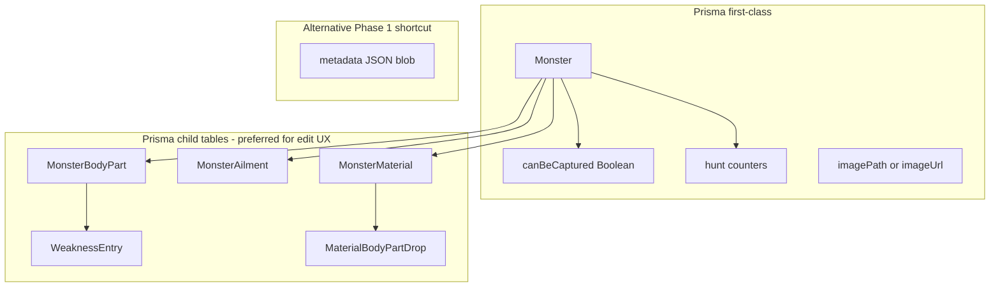

# Monster Hunter Tracker — Feature Expansion Blueprint

> **Parent plan:** [game_tracker_phase2.plan.md](./game_tracker_phase2.plan.md)  
> **Historical v1:** `tdd_game_tracker_f16dde5e.plan.md` (do not edit)

## Objective

Expand the Monster Hunter Tracker with advanced monster management, hunt tracking, weakness analysis, ailment tracking, and material drop tables—without breaking existing quest/encounter/drop logging or dashboard aggregation.

---

## Current baseline (what already exists)


| Blueprint area              | Today                                                         | Location                                                                                 |
| --------------------------- | ------------------------------------------------------------- | ---------------------------------------------------------------------------------------- |
| Hunt counters (DB fields)   | `numberOfHunts`, `wins`, `losses`, `captures`, `failedQuests` | [schema.prisma](../../apps/api/prisma/schema.prisma)                                     |
| Monster image (URL only)    | `imageUrl` nullable                                           | Prisma + [MonsterDetailPage](../../apps/web/src/pages/MonsterDetailPage.tsx) placeholder |
| Stats display (read-only)   | Grid of 5 counters                                            | [MonsterStatsPanel](../../packages/ui/src/games/monster-hunter/MonsterStatsPanel.tsx)    |
| Extensibility hook          | `metadata` JSON on `Monster`                                  | Prisma + [monsters.ts](../../packages/shared/src/schemas/monsters.ts)                    |
| Encounter-based wins        | `POST /quests/encounters` updates stats indirectly            | API quests router                                                                        |
| Drop history (logged hunts) | `Drop` model + list on monster page                           | Separate from **reference drop tables** in blueprint                                     |


**Gap:** Blueprint §5–6 describe **reference material tables** (target/capture/carve %), not the existing **logged drop** records. Keep both: `Drop` = what you actually got; `Material` + matrices = wiki-style reference data per monster.

---

## Implementation strategy

### Storage approach (recommended)




| Data                           | Recommendation                                                                                                        |
| ------------------------------ | --------------------------------------------------------------------------------------------------------------------- |
| `canBeCaptured`, counters      | Already on `Monster`; add `canBeCaptured` column                                                                      |
| `image`                        | Add `imagePath` (uploads dir) **or** keep `imageUrl` + upload endpoint that sets URL                                  |
| `bodyParts[]`, `weaknessGraph` | **Tables:** `MonsterBodyPart`, `WeaknessEntry` (unique `monsterId` + `bodyPartId`)                                    |
| `ailments[]`                   | **Table:** `MonsterAilment` with 5 int fields 0–100; `starRating` computed server-side or in domain only (not stored) |
| `low/high/masterRankDrops`     | **Table:** `MonsterMaterial` with `rank` enum `LOW | HIGH | MASTER` + reward % columns + `MaterialBodyPartDrop`       |


Use `@game-tracker/shared` Zod schemas for every API payload. Put **star rating** and **rank clone** logic in `@game-tracker/domain` (testable, no DB).

---

## 1) Hunt statistics improvements

### Requirements (from blueprint)

- Per counter: `[+]` / optional `[-]` / manual numeric field
- **Hunted** button → `numberOfHunts++`, `wins++`
- **Captured** button → `numberOfHunts++`, `wins++`, `captures++`
- `**canBeCaptured`** setting: when `false`, hide Capture button, capture stat, capture-related UI/calcs

### API design

```
PATCH /api/v1/monsters/:id/stats
Body: { numberOfHunts?: number, wins?: number, ... }           // absolute set
     | { deltas: { numberOfHunts?: 1, wins?: -1, ... } }       // relative

POST /api/v1/monsters/:id/actions/hunted
POST /api/v1/monsters/:id/actions/captured   // 403 if !canBeCaptured
```

Validation: all counters `>= 0`; deltas cannot drive below 0.

### UI (`MonsterStatsPanel` → `MonsterHuntStatsSection`)

- Replace read-only grid with `CounterControl` component
- Header quick actions: **Hunted** | **Captured** (conditional)
- Settings link: **Can be captured** toggle → `PATCH` monster

### Capture toggle behavior


| `canBeCaptured`  | UI                                 | Stats shown                             |
| ---------------- | ---------------------------------- | --------------------------------------- |
| `true` (default) | Captured button + Captures counter | All 5                                   |
| `false`          | Hide capture button; hide Captures | Hunts, Wins, Losses, Failed Quests only |


Dashboard/domain: when aggregating per-monster capture rates, skip monsters with `canBeCaptured === false`.

---

## 2) Monster images

### Requirements

- Upload, replace, remove
- Preview on monster page

### API

```
POST   /api/v1/monsters/:id/image     multipart/form-data
DELETE /api/v1/monsters/:id/image
GET    /uploads/monsters/:filename    static (dev) or CDN later
```

- Store file under `apps/api/uploads/monsters/{monsterId}.{ext}`
- Persist `imageUrl` as `/uploads/monsters/...` or full URL
- Max size + MIME allowlist (`image/jpeg`, `image/png`, `image/webp`)

### UI

- File input + preview; show placeholder when no image
- Remove clears file + nulls `imageUrl`

---

## 3) Weakness graph system

### Axes

**Columns (fixed):** Fire, Water, Thunder, Ice, Dragon, Slash, Blunt, Pierce  
**Rows (dynamic per monster):** Head, Neck, Body, Wing, Foreleg, Hind Leg, Tail, …

### Cell values

- Integer `0`–`99` (two-digit display)
- Editable inline in matrix

### API

```
GET    /monsters/:id/body-parts
POST   /monsters/:id/body-parts        { name }
PATCH  /monsters/:id/body-parts/:bpId  { name }
DELETE /monsters/:id/body-parts/:bpId  (cascade weakness row)

GET    /monsters/:id/weaknesses        // matrix: bodyPartId × damageType → value
PATCH  /monsters/:id/weaknesses        { bodyPartId, slash?, fire?, ... }
```

### UI — **Weaknesses** tab

- Table: sticky header row (elements + physical)
- Row add/rename/delete via settings or inline
- `input[type=number]` min=0 max=99, pad display `05` → `05`

---

## 4) Ailment resistance system

### Default ailments (seed on monster create for `gameId === monster-hunter`)

Poison, Stun, Paralysis, Sleep, Blast, Exhaust, Fireblight, Waterblight, Thunderblight, Iceblight

### Custom ailments

- Add / rename / delete (user-defined `name`, `isCustom: true`)

### Five bars per ailment (0–100%, snap 0/25/50/75/100)

1. Initial Resistance
2. Next Resistance Threshold
3. Maximum Resistance
4. Natural Build-Up Degradation
5. Total Effectiveness (label editable in settings)

### Star rating (`@game-tracker/domain`)

```typescript
// Pseudocode — implement with tests
function computeAilmentStars(ailments: Ailment[]): Map<ailmentId, 0 | 1 | 2 | 3> {
  // Any bar === 0 → 0 stars for that ailment
  const scored = ailments
    .filter(a => allBarsNonZero(a))
    .map(a => ({ id: a.id, total: sum(a.initial, a.threshold, a.max, a.degradation, a.effectiveness) }));
  // Relative within monster: max total → ★★★, mid → ★★, lower → ★
  return assignTiers(scored);
}
```

Display: `★★★` | `★★` | `★` | `-` (0 stars)

### UI — **Ailments** tab

- List ailments with 5 segmented sliders each
- Live star badge per row
- Settings: manage custom ailments + rename bar labels (store in monster `metadata.ailmentLabels` or user prefs)

---

## 5) Material drop table system

### Rank variants

- `LOW` | `HIGH` | `MASTER` — separate material lists per monster

### Rank inheritance (domain + API)


| Action                  | Behavior                                                                                  |
| ----------------------- | ----------------------------------------------------------------------------------------- |
| Create HR from LR       | Clone all LR materials; names append `+` (e.g. `Scale` → `Scale+`); copy % cells; new IDs |
| Create MR from HR       | Clone HR; append `++`                                                                     |
| Edit after clone        | Independent per rank                                                                      |
| New material in HR only | Not visible in LR                                                                         |
| New material in MR only | Not in LR/HR                                                                              |


```
POST /monsters/:id/materials/initialize-rank { from: LOW, to: HIGH }
```

### Material row schema

```typescript
Material {
  id, monsterId, rank, name
  targetReward, captureReward, brokenPartReward, carveReward, dropMaterialReward  // 0-100 each
  bodyPartDrops: { bodyPartId, chance }[]
}
```

### Drop matrix UI — **Materials** tab

- Rank tabs: Low | High | Master
- Matrix: rows = materials, cols = Target | Capture | Broken Part | Carves | Drop Materials
- “Initialize High Rank” / “Initialize Master Rank” buttons when empty

---

## 6) Body-part-specific material drops

- Sub-editor per material row: add `{ bodyPartId, chance }`
- Body parts list shared with weakness tab (`MonsterBodyPart`)
- Example: Gem @ Tail 60%

---

## 7) Target data model (aligned with blueprint)

```typescript
Monster {
  id, name, gameId, userId
  imageUrl | imagePath
  canBeCaptured: boolean

  numberOfHunts, wins, losses, captures, failedQuests

  bodyParts: BodyPart[]
  weaknessEntries: WeaknessEntry[]   // or embedded in graph response
  ailments: Ailment[]
  materials: Material[]              // filtered by rank in API
}

BodyPart { id, monsterId, name, sortOrder }

WeaknessEntry {
  bodyPartId
  slash, blunt, pierce
  fire, water, thunder, ice, dragon   // 0-99 each
}

Ailment {
  id, monsterId, name, isCustom
  initialResistance, nextResistanceThreshold, maximumResistance
  naturalBuildUpDegradation, totalEffectiveness
  // starRating: computed only
}

Material {
  id, monsterId, rank, name
  targetReward, captureReward, brokenPartReward, carveReward, dropMaterialReward
  bodyPartDrops: BodyPartDrop[]
}

BodyPartDrop { bodyPartId, chance }
```

Shared Zod: `packages/shared/src/schemas/monster-hunter.ts` (new file).

---

## 8) UI structure (monster page)

```mermaid
Image + nflowchart TB
  Page[MonsterDetailPage]
  Page --> Header[Image + name + quick actions]
  Page --> Tabs[Tab bar]
  Tabs --> Overview[Overview: stats + notes]
  Tabs --> Weak[Weaknesses matrix]
  Tabs --> Ail[Ailments sliders]
  Tabs --> Mat[Materials LR/HR/MR]
  Tabs --> Set[Settings]
  Tabs --> Drops[Drop history - existing]
```


| Tab                     | Contents                                        |
| ----------------------- | ----------------------------------------------- |
| **Overview**            | Image, Hunted/Captured, counter controls, notes |
| **Weaknesses**          | Body part matrix                                |
| **Ailments**            | Resistance sliders + stars                      |
| **Materials**           | Rank selector, matrices, part drops             |
| **Settings**            | Capture toggle, custom ailments/parts/materials |
| **Hunt log** (optional) | Existing encounter/drop history                 |


Use `@game-tracker/ui` for reusable: `CounterControl`, `WeaknessMatrix`, `ResistanceSlider`, `MaterialDropMatrix`, `RankTabs`.

---

## 9) Suggested build order


| Phase | Scope                                                      | Depends on                     |
| ----- | ---------------------------------------------------------- | ------------------------------ |
| **A** | `canBeCaptured` + stats PATCH + quick actions + counter UI | —                              |
| **B** | Image upload endpoint + UI                                 | A                              |
| **C** | Body parts + weakness matrix API/UI                        | A                              |
| **D** | Ailments + domain star calc + UI                           | C (shared body parts optional) |
| **E** | Materials + rank clone + matrices + part drops             | C                              |
| **F** | Settings tab consolidation                                 | C, D, E                        |
| **G** | Tests + E2E                                                | All                            |


Complete Phase 2 “UI parity” items from [game_tracker_phase2.plan.md](./game_tracker_phase2.plan.md) (quest/encounter forms) **in parallel or after A**—they complement but are not replaced by manual counters.

---

## 10) Testing checklist


| Area                        | Unit (domain/shared) | API (Jest) | UI (Vitest) | E2E      |
| --------------------------- | -------------------- | ---------- | ----------- | -------- |
| Counter +/- and floors at 0 | —                    | ✓          | ✓           | ✓        |
| Hunted / Captured actions   | —                    | ✓          | ✓           | ✓        |
| Capture disabled            | —                    | ✓          | ✓           | ✓        |
| Star: any 0% bar → 0 stars  | ✓                    | ✓          | —           | —        |
| Star: relative tiers        | ✓                    | —          | ✓           | —        |
| HR clone `+` naming         | ✓                    | ✓          | —           | —        |
| MR clone `++`               | ✓                    | ✓          | —           | —        |
| Weakness cell 0–99          | —                    | ✓          | ✓           | optional |


---

## 11) Constraints

- Do not remove existing `Encounter` / `Drop` logging; manual counters coexist (document that encounters may also bump stats—decide single source of truth or sync rules in Phase A design).
- Keep `@game-tracker/`* package names.
- JWT auth on all new routes.
- SQLite-compatible Prisma migrations only.

---

## 12) Open decisions (resolve before Phase C)

1. **Counter sync:** Should `POST .../encounters` also increment manual counters, or only manual/quick actions update them?
2. **Image storage:** Local disk (simpler) vs S3 (production)—start local.
3. **Normalized tables vs metadata JSON:** Plan recommends tables; JSON acceptable only for spike, not long-term.

